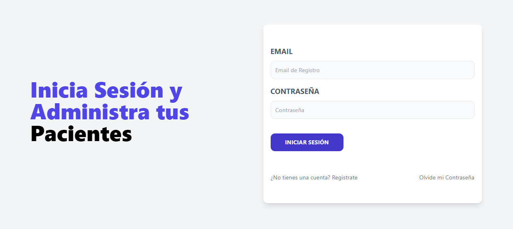
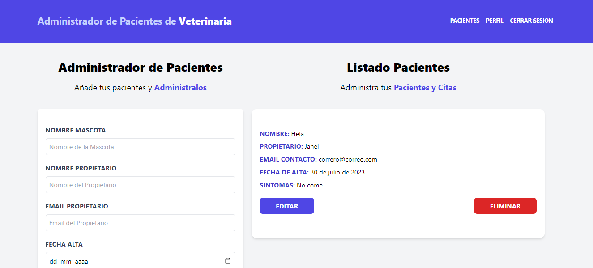
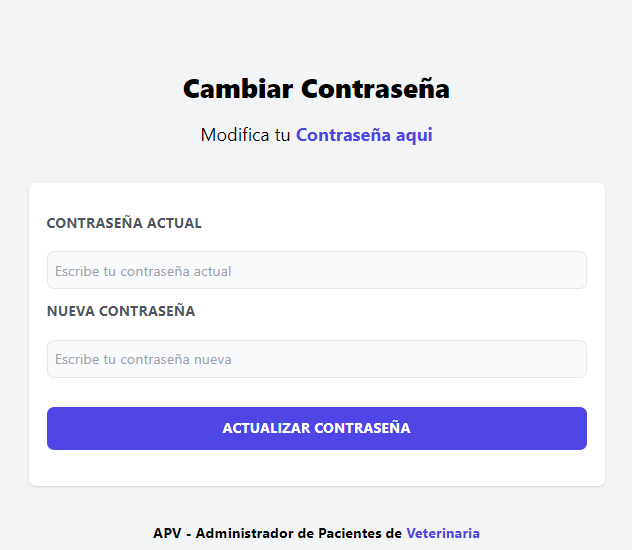

<h1>MERN - APV - Administrador Pacientes Veterianaria  🐕‍🦺🐶🧑‍⚕️</h1>

## Descripción 
Este proyecto es el frontend desarrollado utilizando tecnologías como React, React Router, Axios, Vite y Tailwind CSS. Proporciona una interfaz de usuario interactiva y atractiva para interactuar con el backend del proyecto. 

## Características
- Interfaz de usuario interactiva y atractiva.
- Navegación fluida entre diferentes rutas utilizando React Router.
- Comunicación eficiente con el backend utilizando Axios.
- Desarrollo rápido y eficiente gracias a Vite como bundler.
- Estilos elegantes y personalizables utilizando Tailwind CSS.

## Tecnologías Utilizadas
- React
- React Router
- Axios
- Vite
- Tailwind CSS

## Autor ✒️
**Yechua Silva**

* [LinkedIn](https://www.linkedin.com/in/yechua-silva/)

## Ver ejemplo en vivo 
Ejemplo en vivo FullStack
- [https://mern-apv-yechua-silva.netlify.app/](https://mern-apv-yechua-silva.netlify.app/)

## Configuración

1. Clona el repositorio: `git clone https://github.com/yechua-silva/MERN-apv-frontend.git`
2. Instala las dependencias: `npm install`
3. Configura las variables de entorno en el archivo `.env`.
4. Inicia el servidor de desarrollo: `npm run dev`
  
## Contratación
Si estás interesado en contratarme, puedes ponerte en contacto conmigo escribiendo a yechua-silva@outlook.cl para cualquier consulta o solicitud.
